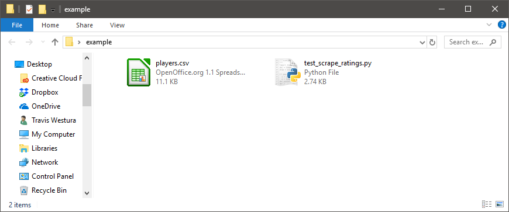
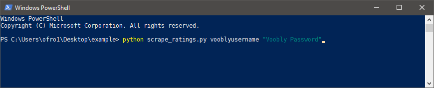

# Voobly Ratings for ECL

A script for scraping Voobly ratings, inspired by a script from Jineapple.

## Usage

Run this script as Python script by running the file `scrape_ratings.py`
```
> python scrape_ratings.py <voobly-username> <voobly-password>
```
I recommend installing the Anaconda Python distribution if you do not already have Python installed: [https://www.anaconda.com/download/](https://www.anaconda.com/download/).

For example, place the `scrape_ratings.py` and `players.csv` files in the same directory.
Open a command line by typing `powershell` into the bar at the top of the Explorer window and pressing Enter.


Then enter the command to run the file.


If there are spaces in your username or password, then you can surround them with double quotation marks, as down with the password in the preceding image.

The players are specified in a file named `players.csv` contained in the same directory as `scrap_ratings.py`
This file starts with a header line, then each line consists of a player name, a comma, and then the URL of that player's Voobly profile.
(This file may end optionally with a blank line.)

An example `players.csv` follows:
```
player-name, voobly-profile-link
TWest,https://www.voobly.com/profile/view/123684015
robo_boro,https://www.voobly.com/profile/view/123905987
smarthy_,https://www.voobly.com/profile/view/124230162
Pete26196,https://www.voobly.com/profile/view/123685133
AkeNo,https://www.voobly.com/profile/view/123723545
```

The url must contain the `www.voobly.com/profile/view/uid` part of the URL.
There may optionally be a `https://` prefix or a suffix to the url, such as `https://www.voobly.com/profile/view/123684015/Ratings/games/profile/123684015/131`.

The result is saved to the file `ratings.csv`.
This file begins with a header line, and each subsequent line contains the name of a player and their ratings, separated by commas.
The file ends in a blank line.
For example:
```
Player, Current 1v1, Highest 1v1, Current TG, Highest TG
TWest, 1709, 1748, 1650, 1680
robo_boro, 1901, 1914, 1674, 1753
smarthy_, 1490, 1652, 1534, 1644
Pete26196, 1656, 1733, 1621, 1648
AkeNo, 1814, 1858, 1689, 1777

```

If a URL appears to be formatted correctly but the player's Voobly user ID is invalid, then the player name and their id is added to the file `invalid.csv`.
This file is modified only if running the script encounters an invalid ID.

## Future Plans
* Multiple Voobly profiles per player, in case highest 1v1 and highest TG ratings are on separate accounts.
* Support for the other ladders so this can pull ratings for other tournaments, e.g. deathmatch tournaments.
* Integration with Google Forms and Sheets and Challonge to automate the signup and bracket creation process.
* GUI interface to make it easier to use for people not familar with a command line.
* Add an option for scraping the player name from the Voobly profile instead of needing to provide it in `players.csv`.
* Voobly provides an API for accessing information about user accounts and ladders here: `https://www.voobly.com/pages/view/147/External-API-Documentation`. Unfortunately, this API currently does not include the highest elo, only the current elo. I would prefer to use the API, if it's ever updated, instead of scraping the website.
